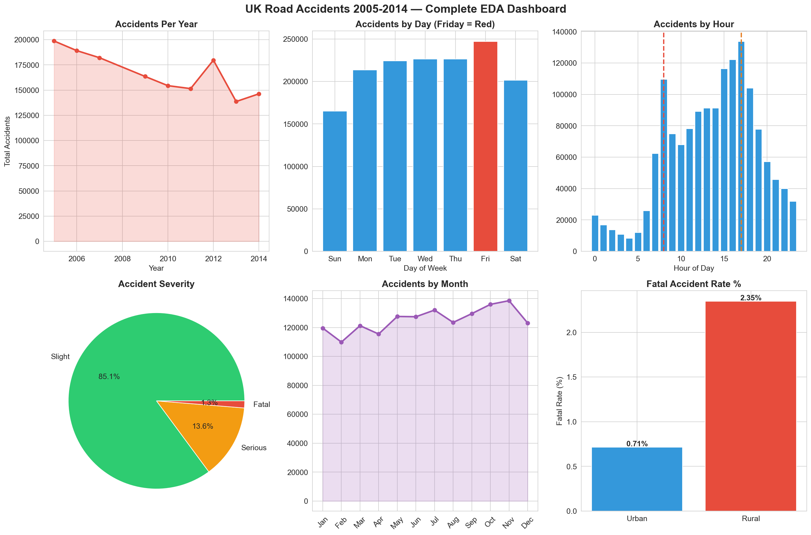

# UK Road Accidents — Full EDA Project

**Author:** Maryam Naveen  
**Date:** 18 May 2026  
**Dataset:** UK Road Accidents 2005–2014 (1,504,150 records)  
**Source:** UK Government Stats19 / Kaggle  
**Tools:** Python · Pandas · Matplotlib · Seaborn  

---

## Project Overview

Exploratory data analysis of 1.5 million UK road accident records spanning 9 years.
Four research questions answered with statistical analysis and visualisations.

---

## Research Questions

1. Are UK roads getting safer over time?
2. When are roads most dangerous?
3. Does bad weather cause most accidents?
4. Urban vs Rural — which is more dangerous?

---

## Key Findings

| Finding | Result |
|---|---|
| Yearly trend | UK roads 26% safer from 2005 to 2014 |
| Most dangerous day | Friday — 247,137 accidents |
| Peak accident hour | 5pm evening rush hour |
| Weather surprise | 80% of accidents in fine weather |
| Urban vs Rural | Urban more accidents, Rural more deadly |
| Most dangerous month | November |

---

## Dashboard

---

## Files

- `day13_full_eda_project.ipynb` — full analysis notebook
- `day13_full_eda_dashboard.png` — 6-panel dashboard

---

## Dataset

[UK Road Accident Dataset — Kaggle](https://www.kaggle.com/datasets/devansodariya/road-accident-united-kingdom-uk-dataset)
